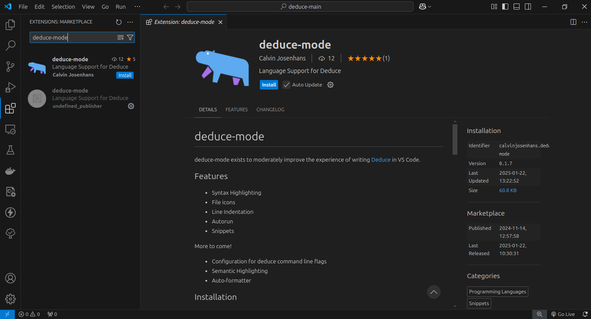
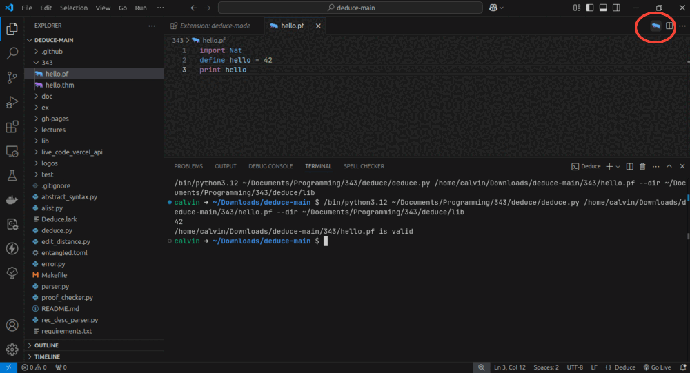

# Lab: Linked Lists

## Overview

For this lab, you will write and test several functions with linked
lists in the Deduce programming language.

### Table of Contents

1. [Deduce Setup](#deduce-setup)
2. **[Problem Set](#problem-set)**
   * Sum
   * Concatenation
   * Quick Reverse
   * Cumulative Sum
   * Search

## Deduce Setup

### Installation

> The following instructions are how we recommend setting up deduce
development for the class, you can find more detailed information
on the [deduce website](https://jsiek.github.io/deduce/pages/getting-started.html).

1. The first thing you should do is install deduce itself.
Download and extract the zip file from 
[github](https://github.com/jsiek/deduce/releases).
2. Open the resulting folder in visual studio code, which you can
install [here](https://code.visualstudio.com/). 
3. Navigate to the extensions menu, and search for and install
the **deduce-mode** extension. This makes it easier to run deduce files
and gives you syntax highlighting, as well as some basic autocomplete options.
    

4. Create a new folder called `343` in the deduce directory, where you
can keep your work for this class. 
5. In the 343 folder, create a file named `hello.pf`. This is your first deduce script!
6.  Paste the following code block into the newly created file.
    ```
    import Nat
    define hello = 42
    print hello
    ```
7. Now you should be able to click the deduce icon at the top right of your window
and run the file!

8. You will probably see some error in the terminal that falls into one of 
two categories.
  - If you see `ModuleNotFoundError: No module named 'lark.tree'`, you
  need to install a missing Python package that deduce relies on. Try running
  `python -m pip install lark` in the terminal. If this works, great! If not, an instructor
  can help.
  - Otherwise, you likely don't have Python installed. Download and run the 
  installer from [python.org](https://www.python.org/). Then add the **Python**
  extension to vscode, much as you did for deduce-mode.
9. If you encounter another error or these steps don't work,
an instructor can help you get things working.
10. If everything went correctly, you should see this in the terminal

    ```
    42
    hello.pf is valid
    ```

## Problem Set

Complete the following exercises in a file named `LabDeduceProgramming.pf`. 
Then submit the file to the 
[autograder](https://autograder.luddy.indiana.edu/web/project/1614). 
Before submitting, you can also write your own tests using `assert` statements
for each of the functions you write.

### Sum the elements of a List

Create a function named `sum` that adds up the elements of a list.  In
particular, the elements are natural numbers, so they have type `Nat`.
You will need to import the type `Nat` and operations, such as
`operator +`, from `Nat.pf`, with the following `import` statement.

```
import Nat
```

You'll also need to import the `List` library.

```
import List
```

Here's the skeleton for your `sum` function.

```
function sum(List<Nat>) -> Nat {
  FILL IN
}
```

The following shows an example use of the `sum` function.

```
assert sum([1,2,3,4]) = 10
```

### Concatenating a List of Lists

Create a function named `concat` that turns a list-of-lists into a
list. The `concat` function should have the following type.

```
concat : < E > fn List<List<E>> -> List<E>
```

In general, you may use any functions in `List.pf`.
The following shows an example use of the `concat` function.

```
assert concat([[1,2,3], [4,5]]) = [1,2,3,4,5]
```

Use this `assert` statement and several of your own to test whether
your `concat` function behaves as expected.


### Quick Reverse, Accumulator-Passing Style

The `reverse` function in `List.pf` is `O(n²)` time because it invokes
append (`operator ++`) `n` times and append is `O(n)`. Create a
function named `quick_rev` that reverses the input list and that is
`O(n)` time. The `quick_rev` function should be generic and have the
following type.

```
quick_rev : < E > fn List<E> -> List<E>
```

Use `assert` statements to test whether your `quick_rev` function
really reverses the input.

Hint: we recommend that you create an auxilliary function that is
written in accumulator-passing style.

Consider the `sum` function that you created above.  We can change
`sum` to accumulator-passing style by adding an extra parameter that
stores the total-so-far.

```
function sum_accum(List<Nat>, Nat) -> Nat {
  sum_accum(empty, total) = total
  sum_accum(node(x, xs), total) = sum_accum(xs, x + total)
}
```

(One side benefit of accumulator passing style is that the function is
tail recursive, which means that it uses `O(1)` space on the procedure
call stack, whereas `sum` uses `O(n)` space.)

```
assert sum([1,2,3]) = sum_accum([1,2,3], 0)
```

### Cumulative Sum of a List

The **cumulative sum** of a list of numbers produces a list where each
element is the sum of all the elements of the input list up to and
including the index of the current element.
So if the input list is 
```
n0, n1, n2, ...
```
the output list is
```
n0, n0+n1, n0+n1+n2, ...
```

Create a function named `cumulative_sum` that performs this operation.
The `cumulative_sum` function should have the following type.

```
cumulative_sum : List<Nat> -> List<Nat>
```

Here is an example of using the `cumulative_sum` function.

```
assert cumulative_sum([3,1,5,2,4]) = [3,4,9,11,15]
```

Test your `cumulative_sum` function with several more `assert`
statements.

### Search (Variant)

Fill in the definition of the following variant of linear `search`.
This `search` function separates the input list into two lists, the
first list does not contain the given number, and the second list
starts with the given number. If the given number is not in the input
list, then the first list is the entire input list and the second list
is empty. To return two lists, use the `Pair` type which you can
import from the `Pair` library.

```
function search(List<Nat>, Nat) -> Pair<List<Nat>, List<Nat> > {
  FILL IN
}
```

Here are some example uses of this `search`.

```
define list_123 = [1,2,3]
assert search(list_123, 1) = pair([], [1,2,3])
assert search(list_123, 2) = pair([1], [2,3])
assert search(list_123, 3) = pair([1,2], [3])
assert search(list_123, 4) = pair([1,2,3], [])
```
