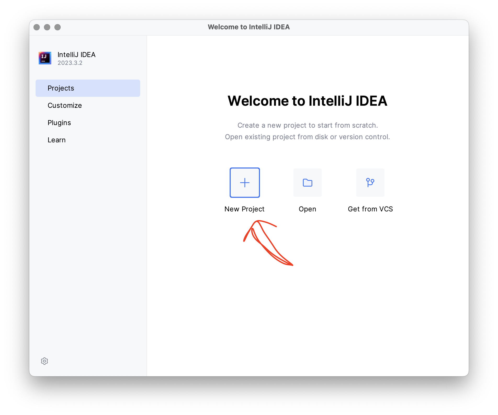
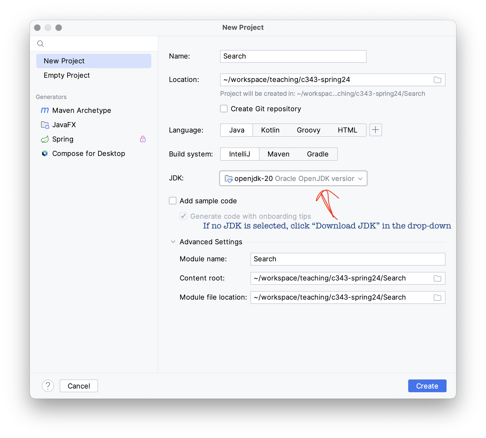
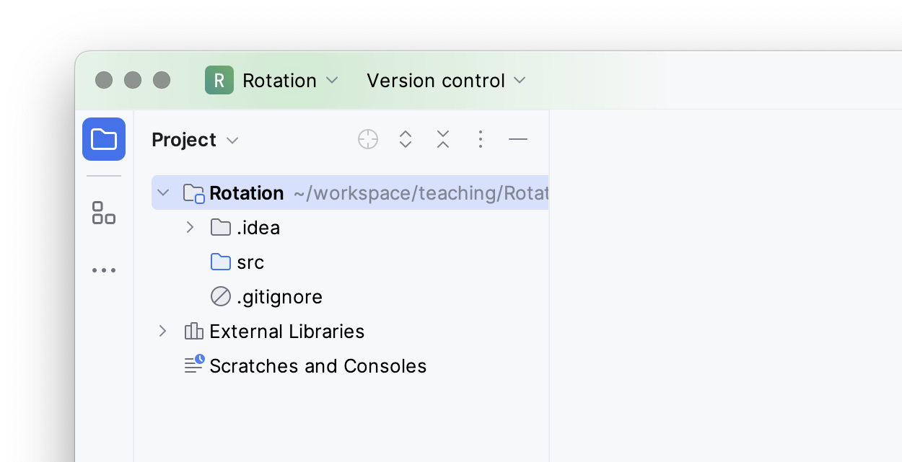
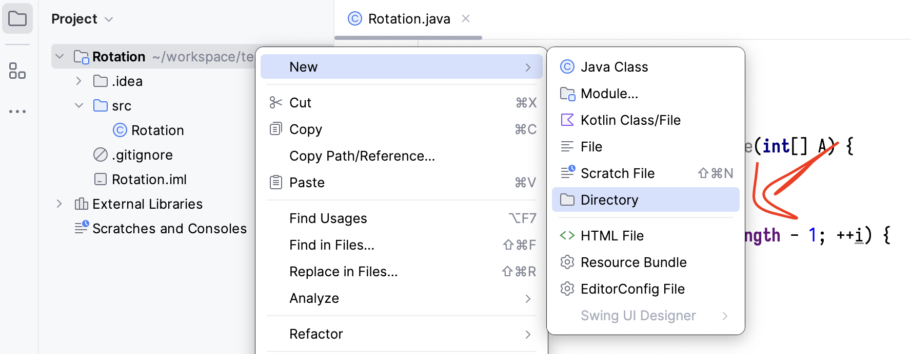
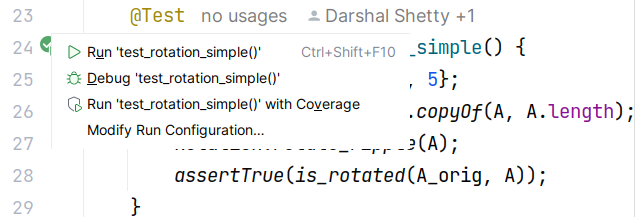
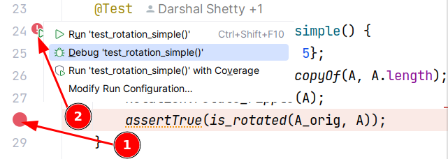
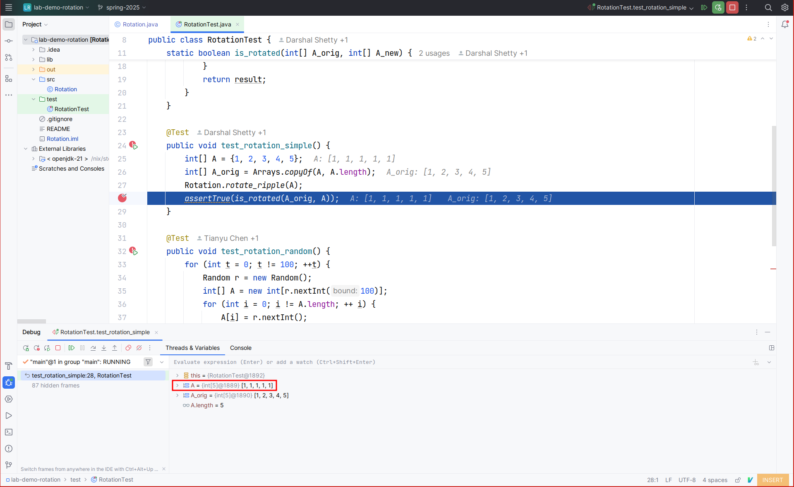

# Lab: Array Search and Testing

## Overview

Welcome to CSCI-C343 "Data Structures"!

In this lab, we will first go through software installation and review
basic testing and debugging skills. You will then be asked to
implement three array search algorithms. Finally, you are supposed to
create test cases for those algorithms and submit both your code and
your test cases to Autograder.

### Table of contents:

1. [Software Installation](#software-installation)
2. [Instructor Demonstration: Testing and Debugging](#instructor-demonstration-testing-and-debugging)
3. [**Task 1:** Implementing Array Search](#task-1-implementing-array-search)
4. [**Task 2:** Testing Array Search](#task-2-testing-array-search)
5. [Submission and Grading](#submission-and-grading)

## Software Installation

+ Download and install [IntelliJ IDEA](https://www.jetbrains.com/idea/download) Community Edition
  - Alternatively, you may use a package manager such as Homebrew: `brew install intellij-idea-ce`
  - Software like IntelliJ is often referred to as
    [IDE](https://en.wikipedia.org/wiki/Integrated_development_environment)s,
    because they integrate a code editor, build tools and a debugger.

+ Launch the IntelliJ IDE
  - In the welcome window, click "New Project".
    In general, we create a new project for each lab. Sometimes a project code
    skeleton is provided to you; in that case, you can use the "Open" button
    to choose the root directory of that project.
    
  - In the pop-up window, enter the title of your lab assignment as "Name".
    For this lab, it should be `Search`.
  - Choose "Location", which is whatever directory that you prefer to contain
    all lab assignments. (Optional: ) check "Create Git repository" if you would
    like to use version control.
  - Language: "Java"; build systems: "IntelliJ"
  - Install JDK. Click "Add SDK -> Download JDK" in the "JDK" drop-down menu:
    
  - In the pop-up window choose "Vendor" : "Oracle OpenJDK". "Version" should
    be filled in automatically (make sure version ≥15). "Location" can be left as default.
    
  - Click "Download" and wait for the download to finish. In the "New Project"
    window, uncheck "Add sample code" and leave everything else as is. Click "Create".

## Instructor Demonstration: Testing and Debugging

In this section I will show you how to:

- Structure your lab projects
- Build and run the code
- Debug and test

The code for this demo is available [here](https://github.com/IUDataStructuresCourse/lab-demo-rotation).

Suppose our tasks are to implement, test and debug the "ripple" approach of array rotation
(recall [lecture](./lectures/array-rotation.md)).
We first create an IntelliJ project called "Rotation". The file structure looks like:



To create the Java class file where our implementation code resides, we right click
on the `src` directory and choose **"Java Class"**:


We enter "Rotation" as its name. IntelliJ creates a new file `src/Rotation.java` whose
content is an empty `public class Rotation`. In the editor, we create `rotate_ripple`
as a public static member function of `Rotation`:

```java
public class Rotation {
    public static void rotate_ripple(int[] A) {
        if (A.length > 1) {
            int tmp1 = A[0];
            for (int i=0; i != A.length - 1; ++i) {
                int tmp2 = A[i+1];
                A[i+1] = tmp1;
                tmp1 = tmp2;
            }
            A[0] = tmp1;
        }
    }
}
```

Our next task is to create unit tests for `rotate_ripple`. Right click on the root
directory and select "New -> Directory". Name the new directory `test`.



Right click on `test` in the file structure. Go to the last item in the pop-up menu
and select "Mark Directory As -> Test **Sources** Root". The `test` directory will be
highlighted in green.

Create a new Java class file in `test` called `RotationTest`. Create `rotate_save_n_shift`
as a private static member function of `RotationTest`.

Our recommended method for testing the output of a function is to
write Java code that check whether the function satisfies its
specification. Here is the specification of rotate.

**Specification:** The `rotate(A)` function moves every element of the input array `A`
to the right by one position, except the last element, which moves to the front.
(Of course, this implies that if `A` is empty, `A` is unchanged.)

We translate this specification of `rotate` into Java code as
following, creating the `is_rotated` function. Because the `rotate`
function changes its input, `is_rotated` requires a copy of the
original array to compare against. The `if` below checks whether the
length was `0` and then makes sure the output array `A_new` is
unchanged, i.e., equal to the input array. The `else` branch checks
that the last element was moved to the front then iterates through the
two arrays using a `for` loop, checking that all the other elements
were moved forward one position.

```
static boolean is_rotated(int[] A_orig, int[] A_new) {
	if (A_orig.length == 0) {
        return Arrays.equals(A_orig, A_new);
	} else {
		boolean result = A_new[0] == A_orig[A_orig.length - 1];
		for (int i = 0; i != A_orig.length - 1; ++i) {
			result = result && (A_orig[i] == A_new[i + 1]);
		}
		return result;
	}
}
```

It may seem like a lot of work to write `is_rotated` instead of just
comparing to the expected output. However, we will soon introduce
testing with randomized input, where we won't be able to write down
the expected output.

Next we import [JUnit](https://junit.org), a Java testing framework. Add the following
lines to the beginning of `RotationTest`:

```java
import org.junit.jupiter.api.Test;
import static org.junit.jupiter.api.Assertions.*;
```

Careful readers may observe that some of the symbols are marked in red.
Move cursor to `junit`, where IntelliJ tells me that it cannot resolve the symbol.
Click on "Add 'JUnit' to classpath" and then "OK". Perform the same action on `jupiter`.


Add the following as a public member function of `RotationTest`:

```java
@Test
public void test_rotation_simple() {
    String test_description = "rotating a small array";
    int[] A = {1, 2, 3, 4, 5};
    int[] A_orig = Arrays.copyOf(A, A.length);
    rotate_save_n_shift(A);
    try {
        assertTrue(is_rotated(A_orig, A));
    } catch (Exception e) {
        fail(test_description + e.toString());
    }
}
```

Note that the function is marked with the `@Test` attribute, which indicates
that it contains a unit test.
The array `{1, 2, 3, 4, 5}` is the example that we talked about in lecture.
We call `rotate_save_n_shift` and check the produced array
using `is_rotated`, which is wrapped in a try-catch block. Should the
assertion fail, the catch clause throws an exception, which contains an error
message that consists of description of the test case and the exception `e`.

We can run this test point by clicking on the green icon:



The rotation implementation is correct, so the test case passes:


Instead of writing one test at a time, we can automate testing,
writing one piece of code that will executing a hundred tests (or
more). Of course, we want the tests to use different inputs, so we
pick the size of th array randomly and fill it with randomly generated
numbers. The next question is how do we check the output of
`rotate_save_n_shift`?  Here's were the work we did to write
`is_rotated` really pays off.  Even though we don't know what the
output array will look like, we can still run `is_rotated` on the
output to make sure it is correct. This powerful approach using
randomized input and checking for properties of the output, is called
[**property based testing**](https://en.wikipedia.org/wiki/Software_testing#Property_testing)
(or property testing for short).

```java
@Test
public void test_rotation_random() {
    String test_description = "rotating an array with random integers";
    for (int t = 0; t != 100; ++t) {
        Random r = new Random();
        int[] A = new int[r.nextInt(100)];
        for (int i = 0; i != A.length; ++ i) {
            A[i] = r.nextInt();
        }
        int[] A_orig = Arrays.copyOf(A, A.length);
        rotate_save_n_shift(A);

        try {
            assertTrue(is_rotated(A_orig, A));
        } catch (Exception e) {
            fail(test_description + e.toString());
        }
    }
}
```

Now that we have multiple test cases, we can select which tests to run
using the drop-down menu in the top-right corner:


Suppose I made a mistake in the implementation. For example, if I did not assign `tmp2`
to `tmp1`, it would cause the entire array to be filled with `A[0]` and produce a wrong
answer. If we remove `tmp1 = tmp2` and rerun the test, it catches the bug by throwing
an assertion error:


Now suppose we would like to debug the issue. We start by inspecting the rotated array.
We can add a breakpoint at `assertTrue(is_rotated(A_orig, A))`. We click on the line number and
it turns into a red dot. Then we choose "Debug ..." from the drop-down menu:



Execution stops at the breakpoint. The arrays `A` and `A_orig` are
displayed in the "Debug" section of IntelliJ. We can see that the
buggy implementation produces `{1, 1, 1, 1, 1}` instead.



We can add more breakpoints by repeating the steps above. Breakpoints are controlled
using the "View Breakpoints" pop-up (the two-overlapping-red-circles button).
We can resume the execution by hitting the green play button ("Resume Program").
Alternatively, we can single-step through the program by pressing the down-arrow button.

## Task 1: Implementing Array Search

### Task Overview

In the first task, we are going to implement three search algorithms as
methods of a Java class called `Search`. Each of the algorithms finds
an element in the input array that meets certain criteria.

Create file `src/Search.java` which contains a public class called `Search`.
Implement each algorithm as a public function of the `Search` class.

### Problem 1: Linear Search on an Array of Booleans

The most basic but surprisingly useful search function involves an
array `A` of boolean values (`true` or `false`).

**Specification:** The `find_first_true(A, begin, end)` function
returns the position of the first `true` in array `A`, that is, find
the smallest index `i` such that `A[i]` is `true`.  The search is
restricted to the subarray within `A` that starts at the `begin` index
and finishes one element before the `end` index.  (This is called a
half-open interval.) If there are no `true` elements in the subarray,
then `find_first_true` returns the `end` position of the subarray. The
caller of `find_first_true` is required to provide a valid half-open
range, which means `begin <= end`, `0 <= begin`, `begin <= A.length`,
`0 <= end`, and `end <= A.length`.

_The time it takes for your algorithm to run should be proportional to the
length of the array `A`._

**[Example 1]** If the input array `A` is

```java
{false, false, true, false, true}
```

then the result should be 2 because `A[2] == true` and there are no
`true` elements at lower indices (`A[0]` and `A[1]` are both `false`).

**[Example 2]** Suppose `A` is the array

```java
{true, false, true, false, true}
```

and we search in the half-open interval `[1,3)`. The answer should be `2`.

```java
find_first_true(A, 1, 3) == 2
```

Add the following method to the `Search` class and fill-in the
implementation:

```java
public static int find_first_true(boolean[] A, int begin, int end) {
    // your code goes here
}
```

### Problem 2: Linear Search on an Array of Integers

Another search function involves an array of integers.

**Specification:** The `find_first_equal(A, x)` function
searches on an array of _integers_ `A`, with the goal of returning
the position of the first element in `A` that is equal to the `x` argument.
If there are no elements equal to `x`, the length of the array is returned.

⚠️ **Use `find_first_true`** to implement the function `find_first_equal`.
Again, the time it takes for your algorithm to run should be proportional
to the length of `A`.

**[Example 3]** Suppose `A` is the array

```java
{32, 11, 4, 5, 99, 5, 32, 75}
```
then the result of search for `5` should be `3`:

```java
find_first_equal(A, 5) == 3
```

Implement the following method in the `Search` class:

``` java
public static int find_first_equal(int[] A, int x) {
    // your code goes here
}
```

### Problem 3: Binary Search on an Array of Booleans

We revisit searching an array of Booleans, but suppose that all of the
`false` elements in the array come before all of the `true` elements (sorted) this time.

**Specification:** The `find_first_true_sorted(A, begin, end)` returns
the position of the first `true` in array `A`, that is, it finds the
smallest index `i` greater or equal to `begin` and less than `end`
such that `A[i]` is `true`.  If there is no `true` within the
half-open range `[begin,end)`, it returns `end`.  The caller must supply a
valid half-open range which means `begin <= end`, `0 <= begin`, `begin <= A.length`,
`0 <= end`, and `end <= A.length`. Furthermore, the
array must already be sorted so that all the `false` elements come before any
`true` elements.

The algorithm should be more efficient and runs in time proportional
to the ⚠️**logarithm** of the length of the array, by
_looking at the element in the middle and restricting
the search to the right or left subarray_ depending on its value.

**[Example 4]** Suppose `A` is the _sorted_ array

```java
{false, false, true, true, true, true, true}
```

The position of the first `true` element is `2` in this case.

Implement your algorithm in the following method of the `Search` class.
Again, restrict your search to the half-open interval `[begin,end)`:

```java
public static int find_first_true_sorted(boolean[] A, int begin, int end) {
    // your code goes here
}
```

## Task 2: Testing Array Search

### Task Overview

In Task 1 we have implemented three search functions. How do we know that
those functions do what their specifications describe?

In Task 2, you are supposed to create test cases for those three implementations.
You should write tests for small and typical inputs, tests for particular corner
cases, and randomized property-based tests in order to find the bugs.

Think about the following questions before you start:

1. What does it mean for each search algorithm to be correct? Hint: their specifications.
2. Can some of the three algorithms share the same properties? Why?
3. What are possible _corner cases_? Hint: arrays with 0 or 1 element, arrays
   with even or odd lengths, start and end positions being equal, ...

### Problem 4: Testing Three Search Functions

Create file `test/StudentTest.java`, which contains `public class StudentTest`.
Create your unit tests as methods of `test/StudentTest.java`.
If you come up with your own test oracles, they should go in
`test/StudentTest.java` as well.

The `StudentTest` class should contain a member function
`public void test()` (marked with `@Test`) which serves as the main entrance.
For example, if you have 2 test functions `test_find_foo()` and `test_find_bar()`,
the `test()` function should be:

```java
@Test
public void test() {
    test_find_foo();
    test_find_bar();
}
```

Inside each test function, `test_find_foo()` or `test_find_bar()`, use JUnit's
[assertions](https://junit.org/junit5/docs/5.0.1/api/org/junit/jupiter/api/Assertions.html)
such as `assertEquals` to check for the correct answer.

**[Example 5]** Suppose we are testing
`Search.find_first_true(A, begin, end)` and the expected result is `2`:

```java
import org.junit.jupiter.api.Test;
import org.junit.jupiter.api.BeforeEach;
import static org.junit.jupiter.api.Assertions.*;

public class StudentTest {

    @Test
    public void test() {
        test_find_first_true();
    }

    @Test
    public void test_find_first_true() {
        // ...
        assertEquals(2, Search.find_first_true(A, begin, end));
    }
}
```

Run the test cases. Does the result meet your expectation? Why?

## Submission and Grading

In this course we use [Autograder](https://autograder.luddy.indiana.edu/) to
provide instantaneous feedback to your lab submissions. Your grades will be
decided by the number of test cases that your _best_ submission passes.
Multiple attempts are allowed.

- Submit `Search.java` to [link](https://autograder.luddy.indiana.edu/web/project/1323)
  + You may submit your code an unlimited number of times.
  + Autograder will run your submission on 8 test cases that thoroughly
    examine the correctness of all three search functions.

- Submit `StudentTest.java` to [link](https://autograder.luddy.indiana.edu/web/project/1319)
  + You may submit your tests an unlimited number of times.
  + Autograder will run your submission on 8 problematic `Search` implementations.
    It also runs one correct implementation to rule out false positive.
    Your test cases are expected to throw exceptions on all implementations
    _except_ the correct one.


-----------------

* You have reached the end of the lab. Yay!
